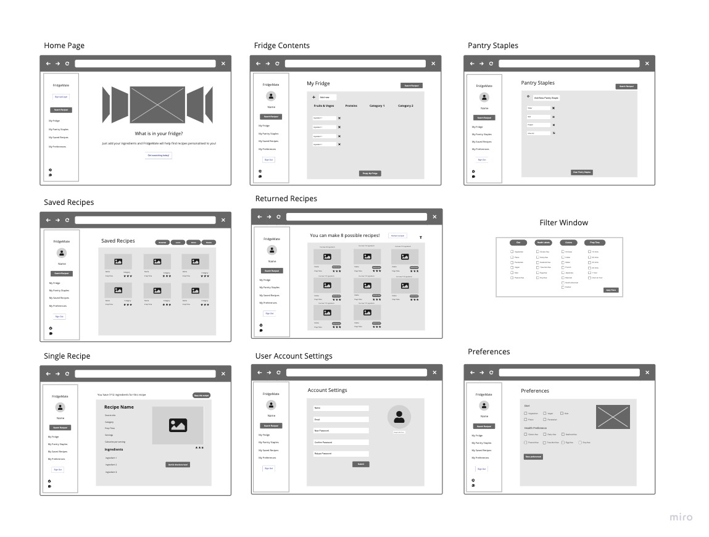

## **Shelby El-rassi and Adrienne Smith T3A2**

### MERN Full Stack Application Assignment

|Shelby El-rassi|Adrienne Smith|
|:-------------:|:-------------:|
|[www.shelby-el-rassi.com](www.shelby-el-rassi.com)  | |
|[github.com/Shelby219](www.shelby-el-rassi.com/)  |[github.com/aes89](https://github.com/aes89) |

---

##### Deployed App: 

##### Documentation Repository: https://github.com/CA-MERN/MERN-Part-A-Docs

##### Client Repository: https://github.com/CA-MERN/MERN-client

##### Server Repository: https://github.com/CA-MERN/MERN-server

---
### Purpose

Click to expand

The purpose of this application is for users to be able to enter ingredients which are always on their grocery list/fridge with the intent to search for recipes made up from those ingredients. The idea for this web application stemmed from the situation of the first Australian lockdown of Covid19, in which stores sold out of a lot of popular and favourite grocery items of customers. An application such as this means users can input the ingredients they have currently at home and recipes including these ingredients will be displayed. Along side this factor is the need for users to stick to a grocery budget, so they do not want to be constantly going to the store to get expensive ingredients. Also the type of users using this app are ones that need recipe inspiration for their weekly meals, ones that search recipes based on dietary requirements and excluded ingredients, and also users that are new to the cooking scene and want to start with cooking by just utilising ingredients already at home. This app can help to minimise food waste by helping users to combine items they may not have made a meal with otherwise.

The overall goal of this application is a search application based on user ingredient lists, with the ability to save those recipes, like and review recipes. 

---
### Functionality / features

Click to expand

#### MVP Features
* User accounts
    * Signup
    * Login
    * Logout
    * Edit details
    * Delete account.
* User dashboard
    * Default Pantry Staples List which can also be add or deleted. (like salt, pepper, olive oil, vinegar)  
    * View grocery list by category.
    * Recipe interaction (saved, liked, reviewed).
* Main Application
    * Grocery input, add and delete. Implement predictive search.
    * Implement alternate ingredient middleware matching eg. Cilantro = coriander if API does not have in place. 
    * Recipe search button on main interface.
    * Return recipes in sorted categories (breakfast, lunch, dinner).
    * Filter feature used for diet filter, prep time . 
    * Save recipes to favourites.
    * Vote and review on best recipes.

#### Nice to Have Features
* Search History capture.
* User can add a photo of their cooked dish, public or private collection. 
* Oauth with signup and login. 
* Recipes of the week on the home page
* Saved recipes in recipe collections
* categories for ingredients
* filter saved recipes by breakfast/lunch/dinner/snacks.
* review recipe
* view best recipes

---
### Target audience

Click to expand

<<<<<<< HEAD
<<<<<<< HEAD
* Key Demographics
    - Gender: Anyone, but predominantly women.
=======
Key Demographics
    - Gender: Anyone, predominantly women.
>>>>>>> 8852535317198f2ad0a475c4bcedf09c5fe29258
    - Age: 20-55.
    - Family status: Cooking for self, partner or dependents.
    - Profession: Students, professionals and homemakers.
    - Language: English.
    - Main interests: cooking, health, diet, low waste, saving money, trying new things.

* Key Psychographics
    - Dislikes repetitive meals, like variety and new options.
    - Dislikes spending lots of money on lots of ingredients and food waste.
    - Enjoys sharing and preparing meals.

* Challenges
    - Finds it difficult to create recipes
    - Has a limited food budget or limited access to ingredients
    - Has an interest in cooking but limitations (eg budget, dietary restrictions, skill).

* Preferred Channels
     - Follows celebrity chefs and food themed accounts on social media.
     - Searches for recipes/blogs on Google.

* Preferred Content Types
    - Articles.
    - Blog posts.
    - Social media posts.
=======
**Key Demographics**
* Gender: Anyone, predominantly women.
* Age: 20-55.
* Family status: Cooking for self, partner or dependents.
* Profession: Students, professionals and homemakers.
* Language: English.
* Main interests: cooking, health, diet, low waste, saving money, trying new things.

**Key Psychographics**
* Dislikes repetitive meals, like variety and new options.
* Dislikes spending lots of money on lots of ingredients and food waste.
* Enjoys sharing and preparing meals.

**Challenges**
* Finds it difficult to create recipes
* Has a limited food budget or limited access to ingredients
* Has an interest in cooking but limitations (eg budget, dietary restrictions, skill).

**Preferred Channels**
* Follows celebrity chefs and food themed accounts on social media.
* Searches for recipes/blogs on Google.

**Preferred Content Types**
* Articles.
* Blog posts.
* Social media posts.
>>>>>>> 26ed972f2207cd1b1d7334ab5da008b6c7d1f471

---
### Tech stack

Click to expand

**Design and Planning**
* Trello
* Figma
* xtensio
* Draw.io  
* Slack   

**Frontend**
* HTML5
* CSS3
* React JS
* JavaScript
* JSX
* Material-UI
* Bootstrap
* Axios

**Backend**
* ExpressJS
* Node JS

**Database**
* MongoDB
* Mongoose

**Testing**
* Cypress
* Supertest

**Other**
* Edamam API
* Heroku
* Netlify

---
### Dataflow Diagram

Click to expand

---
### Application Architecture Diagram

Click to expand

---
### User Stories

Click to expand

#### Personas

#### Version 1 - MVP
##### Overall User
 

* As a overall user who is not logged in I can navigate to the home page and:
    * click "Login/Sign Up" and get a pop up.
    * login/sign up using Google Oauth or email/password details.
    * click on any link and be prompted to log in/sign up with a popup. 

* As a overall, logged in user I can navigate to the home page and:
    * navigate to my <a href="#accsettings">account settings</a>.
    * search recipes and be redirected to <a href="#searchresults">search results</a>. 

* As a overall user I navigate to my <a id="accsettings">account settings and:</a>
    * edit my account details.
    * delete my account.

* As an overall user I can see my dash on all pages (once logged in) and:
    * navigate to <a href="#myfridge">My Fridge</a> page.
    * navigate to <a href="#mypantry">My Pantry Staples</a> page.
    * navigate to <a href="#mysaved">My Saved Recipes</a> page.
    * search recipes and be redirected to <a href="#searchresults">search results</a>.
    * navigate to the <a href="#mypreferences">My Preferences</a> page.

* As an overall user I can navigate to <a id="myfridge">My Fridge page</a> and:
    * remove all items from my list with the "Empty My Fridge" button, which will confirm my choice.
    * add ingredients to my list using predictive input.
    * remove ingredients from my list.
    * search for recipes by pressing the "search" button and be redirected to the <a href="#searchresults">results</a> page.
  
* As an overall user I can navigate to <a id="mypantry">My Pantry Staples page</a> and:
    * add a pantry staple.
    * delete a pantry staple.

* As an overall user I can navigate to <a id="mysaved">My Saved Recipes page</a> and:
    * view my saved recipes with their name, category and preparation time.
    * navigate to a <a href="#single">single recipe's</a> page.

* As an overall user, when redirected to the <a id="searchresults">search result</a> page I can:
    * view returned results with their name, category and preparation time.
    * navigate to a <a href="#single">single recipe's</a> page.
    * filter results with the filter button, returning a pop up with filter choices.
    
* As an overall user I can navigate to a <a id="single">single recipe page</a> and:
    * view full details of a recipe including original web address, average user rating, category, preparation time, servings, calories, ingredients, preparation and photo.
    * navigate to the original web address.
    * view how many ingredients I have and how many are required (ie "You have 7/10 required ingredients").
    * rate a recipe.

* As an overall user I can navigate to <a id="mypreferences">My Preferences page</a> and:
    * enter/update preferred dietary requirements (eg vegetarian).
    * enter/update preferred dietary restrictions (eg no nuts).

##### Sarah 
* As a mother and busy worker…
    * I would like to have a tool where I can utilise my current groceries to the fullest.
    * I would like to find some recipe variety for my family.
    * I would like to be able to filter via prep time in case I want a quick and easy recipe.
    * I would like a tool that is simple and easy to use.
    * I would like to see my saved recipes so I can use them another time if I like them.
    * I would like to filter via gluten free due to my child’s allergies.
    * I would like to see the nutrient values in the recipes as I am health conscious.

##### Wayne 
* As a full-time worker and novice chef...
    * I would like to view times on recipes when deciding what to try to cook.
    * I would like a simple interface without confusing options.
    * I would like the app to remember my items so I do not need to reenter staples.
    * I would like to see how many ingredients are missing when selecting a recipe.
    
##### Eliza 
* As a student and vegetarian…
    * I would like to have a tool to find recipe inspiration with my favourite ingredients.
    * I would also like a tool to find dishes with alternatives to my favourite ingredients.
    * I would like to be able to filter recipes based on my dietary needs as a vegetarian.
  
##### Bez 
* As a chef with an egg surplus, an interest in learning different ways to cook them and some extra time for cooking...
    * I would like to save recipes for later.
    * I would like to see how many more ingredients I need without reading the whole recipe.
    * I would like to filter searches by how long a recipe takes, for when I have more/less time.

#### Version 2 - Extra Features

##### Sarah 
* As a mother and busy worker…

##### Wayne 
* As a full-time worker and novice chef...
    * I can see other user's reviews on recipes to decide if I will try it.
    * I would like to limit the amount of ingredients in recipes I search.

##### Eliza 
* As a student and vegetarian…

##### Bez 
* As a chef with an egg surplus, an interest in learning different ways to cook them and some extra time for cooking...
    * I would like to search for a recipe by dish type (eg soup) and ingredients.
    * I would like to search for recipes without an ingredient, for when I am sick of eggs.
    * I would like to search recipes by cuisine type (eg Spanish) so I can choose matching music.

---
### Wireframes

#### Version 1

Click to expand

#### Mobile

#### Tablet

#### Desktop

#### Nav and Footer

#### Pop Out Windows

#### Version 2

Click to expand

#### Mobile

#### Tablet

#### Desktop

---
### Project Management
#### Trello Screenshots

Click to expand

