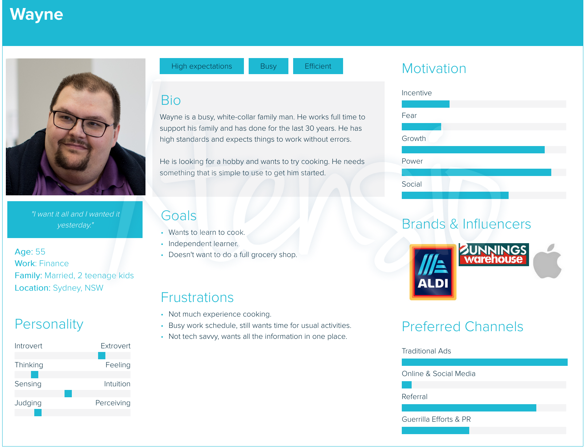
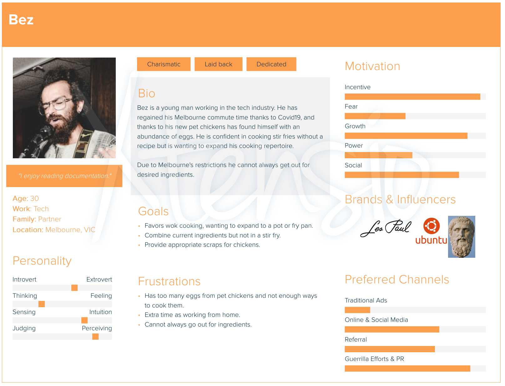

## **Shelby El-rassi and Adrienne Smith T3A2**

### MERN Full Stack Application Assignment

|Shelby El-rassi|Adrienne Smith|
|:-------------:|:-------------:|
|[www.shelby-el-rassi.com](www.shelby-el-rassi.com)  | |
|[github.com/Shelby219](www.shelby-el-rassi.com/)  |[github.com/aes89](https://github.com/aes89) |

---

##### Deployed App: 

##### Documentation Repository: https://github.com/Shelby219/MERN-Part-A-Docs

##### Client Repository: https://github.com/Shelby219/MERN-client

##### Server Repository: https://github.com/Shelby219/MERN-server

---
### Purpose

Click to expand

---
### Functionality / features

Click to expand

#### MVP Features
* User accounts
    * Signup
    * Login
    * Logout
    * Edit details
    * Delete account.
* User dashboard
    * Default Pantry Staples List which can also be add or deleted. (like salt, pepper, olive oil, vinegar)  
    * View grocery list by category.
    * Recipe interaction (saved, liked, reviewed).
* Main Application
    * Grocery input, add and delete. Implement predictive search.
    * Implement alternate ingredient middleware matching eg. Cilantro = coriander if API does not have in place. 
    * Recipe search button on main interface.
    * Return recipes in sorted categories (breakfast, lunch, dinner).
    * Filter feature used for diet filter, prep time . 
    * Save recipes to favourites.
    * Vote and review on best recipes.

#### Nice to Have Features
* Search History capture.
* User can add a photo of their cooked dish, public or private collection. 

---
### Target audience

Click to expand

---
### Tech stack

Click to expand

* Design and Planning
    * Trello
    * Figma
    * xtensio
    * Draw.io
            
* Frontend
    * React
    * HTML CSS
    * Materialize UI
    * Bootstrap
    * HTML
    * SCSS
    * JavaScript

* Backend
    * MongoDB
    * ExpressJS
    * Node JS

* Other
    * Edamam API
    * Heroku
    * Netlify

---
### Dataflow Diagram

Click to expand

---
### Application Architecture Diagram

Click to expand

---
### User Stories

Click to expand

#### Personas

#### Version 1
##### Overall User
* I can go to the home page signup to create an account
* I can login
* I can navigate to my account settings and edit my account details
* I can navigate to the account settings and delete the account
* I can navigate to my dash and see what recipes I have interacted with (vote, save, reviewed) so I can quickly access/reaccess them later.
* I can navigate to my dash and see my current groceries organised by category
* I can navigate to my dashboard and see my current pantry staples
* I can navigate to main interface and see 'get searching today'!
* Once an initial search is done, I want see 'refresh again'
* From main interface  I can make a recipe search 
* From main interface I can navigate to my grocery lists
* From main interface I can navigate to my saved recipes
* I can add more groceries with predictive input
* I can delete groceries from my list
* I can see my recipes returned search with them categories in breakfast, lunch and dinner
* I can further filter by diet (eg vegan) and prep time
* I can see my recipes returned via list with image, name, time and calories
* I can click go to recipe
* I can click a like heart on the recipe
* On a clicked recipe page I can click the save recipe button
* On a clicked recipe page I can view the whole recipe
* On a clicked recipe page I can rate the recipe

##### Sarah 
* As a mother and busy worker…
    *  I would like to have a tool where I can utilise my current groceries to the fullest
    * I would like to find some recipe variety for my family.
    * I would like to be able to filter via prep time in case I want a quick and easy recipe.
    * I would like a tool that is simple and easy to use.
    * I would like to see my saved recipes so I can use them another time if I like them.
    * I would like to filter via gluten free due to my child’s allergies.
    * I would like to see the nutrient values in the recipes as I am health conscious.
##### Wayne 
* aaa
    *
    *
    *
    *
##### Eliza 
* As a student and vegetarian…
    * I would like to have a tool to find recipe inspiration with my favourite ingredients.
    * I would like a tool to find dishes with alternatives to my favourite ingredients.
    * I would like to be able to filter recipes based on my dietary needs as a vegetarian.
##### Bez 
* aaa
    *
    *
    *
    *

#### Version 2

#### Version 3

---
### Wireframes

Click to expand

#### Mobile

#### Tablet

#### Desktop

---
### Project Management
#### Trello Screenshots

Click to expand

