# fridgeMate

##### Created by:
#### Adrienne Smith | [GitHub](https://github.com/aes89) | and Shelby El-rassi | [GitHub](https://github.com/Shelby219) |

---
### Documentation Repository
---

---

 
##### Deployed App: https://fridgemate.netlify.app/

##### Documentation Repository: https://github.com/CA-MERN/MERN-Part-A-Docs

##### Client Repository: https://github.com/CA-MERN/MERN-client

##### Server Repository: https://github.com/CA-MERN/MERN-server

---

### Purpose

Click to expand

The purpose of this application is for users to be able to enter ingredients which are always on their grocery list/fridge with the intent to search for recipes made up from those ingredients. The idea for this web application stemmed from the situation of the first Australian lockdown of Covid19, in which stores sold out of a lot of popular and favourite grocery items of customers. An application such as this means users can input the ingredients they have currently at home and recipes including these ingredients will be displayed. Alongside this factor is the need for users to stick to a grocery budget, so they do not want to be constantly going to the store to get expensive ingredients. Also, the type of users using this app are ones that need recipe inspiration for their weekly meals, ones that search recipes based on dietary requirements and excluded ingredients, and also users that are new to the cooking scene and want to start with cooking by just utilising ingredients already at home. This app can help to minimise food waste by helping users to combine items they may not have made a meal with otherwise.

The overall goal of this application is a search application based on user ingredient lists, with the ability to save those recipes, rate and review recipes. 

---
### Functionality / features

Click to expand

#### MVP Features
* User Authentication & Account:
    * Sign up
    * Login
    * Logout
    * Edit account details in account settings.
    * Upload profile image.
    * Delete account.
    * Edit user preferences for diet and health labels. 
* Navigation Bar:
    * When not signed in can navigate to Sign up/login pop out windows.
    * When not signed in the other nav links forward to sign up/login pop out windows.
    * When signed in can navigate to 'My Fridge'.
    * When signed in can navigate to 'My Pantry Staples'.
    * When signed in can navigate to 'My Preferences'.
    * When signed in can click the Search Recipes button and will forward to browse recipe page.
* Home Page:
    * Random food joke displayed each fresh from API.
    * Get Searching Today link with either returns recipe page or link to sign up.
* My Fridge Page:
    * Can add new ingredients.
    * Can delete ingredients.
    * Can clear whole fridge list with a warning alert before submitting.
    * Predictive text on the ingredient input.
* Pantry Staples Page:
    * Starts off with default staples (like salt, pepper, olive oil, vinegar).
    * Can add new staples.
    * Can delete staples.
* Returned Recipe Search Page:
    * View list of returned recipes based on the user's fridge and pantry contents.
    * Title of the page is how many recipes the user can make.
    * Each recipe you can see name, image, prep time.
    * Each recipe you can see how many ingredients you have to make it e.g. "You have 4/8 ingredients".
    * Filter feature used to filter recipes, this include diet, health labels, cuisine and prep time. 
    * Save option under each recipe to save to user's recipe collection. 
    * If recipe in users saved collection, alert on screen (change button colour).
* Single Recipe page:
    * The recipe information includes name, image, source, prep time, servings and calories per serving. 
    * Ingredients are listed.
    * Link to full directions displayed.
    * Button to save the recipe to user collection. 
    * If the recipe is in the users saved collection display data from that, else call the food API.
* Account Settings:
    * User can update their profile picture, name, email and password. 
    * Current data gets preloaded as placeholder.
    * Save button then loads and alerts the user of saved. 
* Preferences:
    * The user can set diet and health preferences (via checkboxes) which will automatically be used to filter the recipes returned. 
* Saved Recipes:
    * Each recipe you can see name, image, category, prep time.
    * Filter buttons at the top to show dishes based off Breakfast, lunch, dinner, snack.
    * Click on the recipe to go to single recipe page and display recipe data from saved data.
* Smart Features:
    * Implement alternate ingredient middleware matching e.g. Cilantro = coriander if API does not have in place. 
   
#### Nice to Have Features
* Search History capture.
* Oauth with sign up and login.
* Recipes of the week on the home page.
* Different collections for saved recipes.
* Categories for ingredients in Fridge.
* User can rate a recipe.
* User can write a review on a recipe (including picture).

---
### Target audience

Click to expand

**Key Demographics**
* Gender: Anyone, predominantly women.
* Age: 18-55.
* Family status: Cooking for self, partner or dependents.
* Profession: Students, professionals and homemakers.
* Language: English.
* Main interests: cooking, health, diet, low waste, saving money, trying new things.

**Key Psychographics**
* Dislikes repetitive meals, like variety and new options.
* Dislikes spending lots of money on lots of ingredients and food waste.
* Enjoys sharing and preparing meals.

**Challenges**
* Finds it difficult to create recipes.
* Has a limited food budget or limited access to ingredients.
* Has an interest in cooking but limitations (e.g. budget, dietary restrictions, skill).

**Preferred Channels**
* Follows celebrity chefs and food themed accounts on social media.
* Searches for recipes/blogs on Google.

**Preferred Content Types**
* Articles.
* Blog posts.
* Social media posts.

---
### Tech stack

Click to expand

**Design and Planning**
* Trello (Planning)
* Miro (Wireframing)
* xtensio (Personas)
* Framer (Prototypes)
* Lucid Chart (Diagramming)
* Slack (Team Communication)

**Frontend**
* HTML5 
* CSS3
* React JS
* JavaScript
* JSX 
* Material-UI
* Axios (Http Requests)

**Backend**
* ExpressJS
* Node JS
* Passport (Authentication)
* Passport-JWT (Json Web Token Auth)
* Express Session (Session Tracking)
* AWS s3 (Profile Image Upload)

**Database**
* MongoDB
* Mongoose

**Testing**
* Cypress- Front-end
* Supertest- (Server Testing)
* SuperAgent (Server Testing)
* Mocha- (Testing Framework)

**Other**
* Spoonacular API For recipes
* Heroku - (Deployment Server)
* Netlify- (Deployment Client)

---
### Dataflow Diagram

Click to expand

[Click here to View on Lucid Chart](https://lucid.app/lucidchart/invitations/accept/63016e48-cfa5-489b-b7fc-e2e8c84311d2)

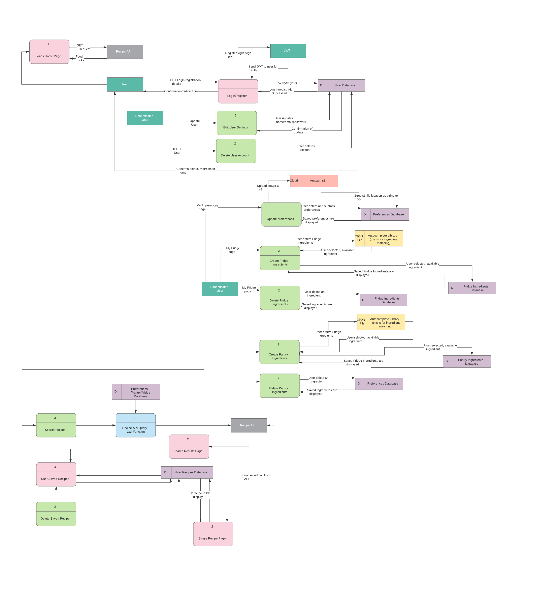

---
### Application Architecture Diagram

Click to expand

[Click here to View on Lucid Chart](https://lucid.app/lucidchart/invitations/accept/8e98769d-0f56-4e25-8b80-25d8c69c2047)

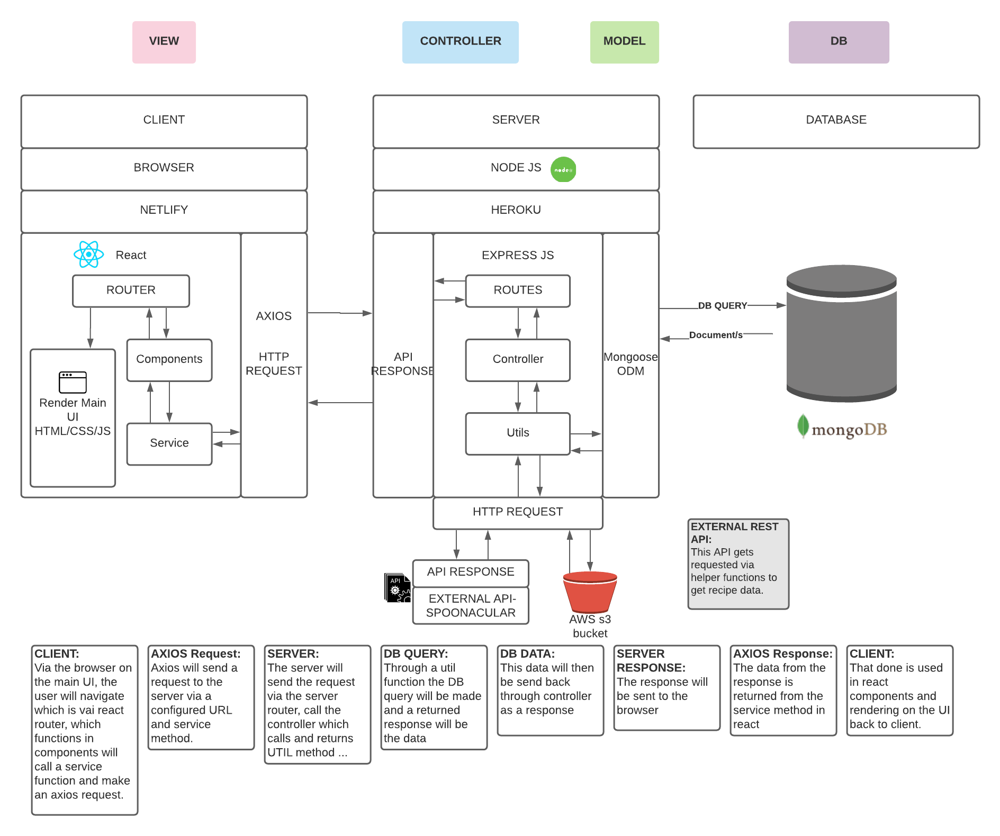

    

---
### User Stories

#### Personas

Click to expand

#### Intial Draft Stories

Click to expand

* As a overall user:
    * I can go to the home page sign up to create an account
    * I can login
    * I can navigate to my account settings and edit my account details
    * I can navigate to the account settings and delete the account
    * I can navigate to my dash and see what recipes I have interacted with (vote, save, reviewed) so I can quickly access/reaccess them later.
    * I can navigate to my dash and see my current groceries organised by category
    * I can navigate to my dashboard and see my current pantry staples
    * I can navigate to main interface and see 'get searching today'!
    * Once an initial search is done, I want see 'refresh again'
    * From main interface  I can make a recipe search 
    * From main interface I can navigate to my grocery lists
    * From main interface I can navigate to my saved recipes
    * I can add more groceries with predictive input
    * I can delete groceries from my list
    * I can clear all my grocery list
    * I can clear all of my grocery list
    * I can see my recipes returned search with them categories in breakfast, lunch and dinner
    * I can further filter by diet (eg vegan) and prep time
    * I can see my recipes returned via list with image, name, time and calories
    * I can click go to recipe
    * I can click a like heart on the recipe
    * On a clicked recipe page I can click the save recipe button
    * On a clicked recipe page I can view the whole recipe
    * On a clicked recipe page I can rate the recipe

#### MVP
 

Click to expand

##### Overall User
* As a overall user who is not logged in I can navigate to the home page and:
    * click "Login/Sign Up" and get a pop up.
    * click on any link and be prompted to log in/sign up with a popup. 

* As a overall, logged in user I can navigate to the home page and:
    * navigate to my <a href="#accsettings">account settings</a>.
    * search recipes and be redirected to <a href="#searchresults">search results</a>. 

* As a overall user I navigate to my <a id="accsettings">account settings and:</a>
    * edit my account details.
    * delete my account.

* As an overall user I can see my side navigation on all pages and:
    * navigate to <a href="#myfridge">My Fridge</a> page.
    * navigate to <a href="#mypantry">My Pantry Staples</a> page.
    * navigate to <a href="#mysaved">My Saved Recipes</a> page.
    * search recipes and be redirected to <a href="#searchresults">search results</a>.
    * navigate to the <a href="#mypreferences">My Preferences</a> page.
    * click sign up if not logged in
    * click login if not logged in
    * click logout if logged in

* As an overall user I can navigate to <a id="myfridge">My Fridge page</a> and:
    * remove all items from my list with the "Empty My Fridge" button, which will confirm my choice.
    * add ingredients to my list using predictive input.
    * remove ingredients from my list.
    * search for recipes by pressing the "search" button and be redirected to the <a href="#searchresults">results</a> page.
  
* As an overall user I can navigate to <a id="mypantry">My Pantry Staples page</a> and:
    * add a pantry staple.
    * delete a pantry staple.

* As an overall user I can navigate to <a id="mysaved">My Saved Recipes page</a> and:
    * view my saved recipes with their name, category and preparation time.
    * delete a saved recipe
    * navigate to a <a href="#single">single recipe's</a> page.

* As an overall user, when redirected to the <a id="searchresults">search result</a> page I can:
    * view returned results with their name, category and preparation time.
    * navigate to a <a href="#single">single recipe's</a> page.
    * filter results with the filter button, returning a pop up with filter choices.
    * click save recipe
    
* As an overall user I can navigate to a <a id="single">single recipe page</a> and:
    * view full details of a recipe including original web address, average user rating, category, preparation time, servings, calories, ingredients, link to full directions and photo.
    * navigate to the original web address.
    * view how many ingredients I have and how many are required (ie "You have 7/10 required ingredients").

* As an overall user I can navigate to <a id="mypreferences">My Preferences page</a> and:
    * enter/update preferred dietary requirements (e.g. vegetarian).
    * enter/update preferred dietary restrictions (e.g. no nuts).

##### Sarah 
* As a mother and busy worker…
    * I would like to have a tool where I can utilise my current groceries to the fullest.
    * I would like to find some recipe variety for my family.
    * I would like to be able to filter via prep time in case I want a quick and easy recipe.
    * I would like a tool that is simple and easy to use.
    * I would like to see my saved recipes so I can use them another time if I like them.
    * I would like to filter via gluten free due to my child’s allergies.
    * I would like to see the nutrient values in the recipes as I am health conscious.

##### Wayne 
* As a full-time worker and novice chef...
    * I would like to view times on recipes when deciding what to try to cook.
    * I would like a simple interface without confusing options.
    * I would like the app to remember my items so I do not need to repeatedly enter staples.
    * I would like to see how many ingredients are missing when selecting a recipe.
    
##### Eliza 
* As a student and vegetarian…
    * I would like to have a tool to find recipe inspiration with my favourite ingredients.
    * I would also like a tool to find vegetarian dishes with alternatives to my favourite ingredients.
    * I would like to be able to filter recipes based on my dietary needs as a vegetarian.
  
##### Bez 
* As a chef with an egg surplus, an interest in learning different ways to cook them and some extra time for cooking...
    * I would like to save recipes for later.
    * I would like to see how many more ingredients I need without reading the whole recipe.
    * I would like to filter searches by how long a recipe takes, for when I have more/less time.

#### Nice to have Extra Features
 

Click to expand

* As a overall user who is not logged in I can navigate to the home page and:
    * login/sign up using Google Oauth.

* As a overall user I can navigate to home page and:
    * View some highlighted recipes of the week.

* As an overall user, when redirected to the <a id="searchresults">search result</a> page I can:
    * view returned results as above along with average star rating. 
    * Click save recipe and be prompted to save to a collection.

* As an overall user I can navigate to <a id="mysaved">My Saved Recipes page</a> and:
    * View my recipe collections
    * Create a new collection
    * Edit a collection
    * Delete a collection

* As an overall user I can navigate to <a id="myfridge">My Fridge page</a> and:
    * View all my ingredients by category
  
* As an overall user I can navigate to a <a id="single">single recipe page</a> and:
    * view recipe as above, along with the average star rating.
    * view written all written reviews at bottom of recipe.
    * Click review recipe, and pop out window comes up to write a review and add a star rating. 
    

---
### Design Planning

#### Mood Board

Click to expand

#### Wireframes

Click to expand

[Click here to View on Miro](https://miro.com/app/board/o9J_led5nw4=/)

#### Mobile
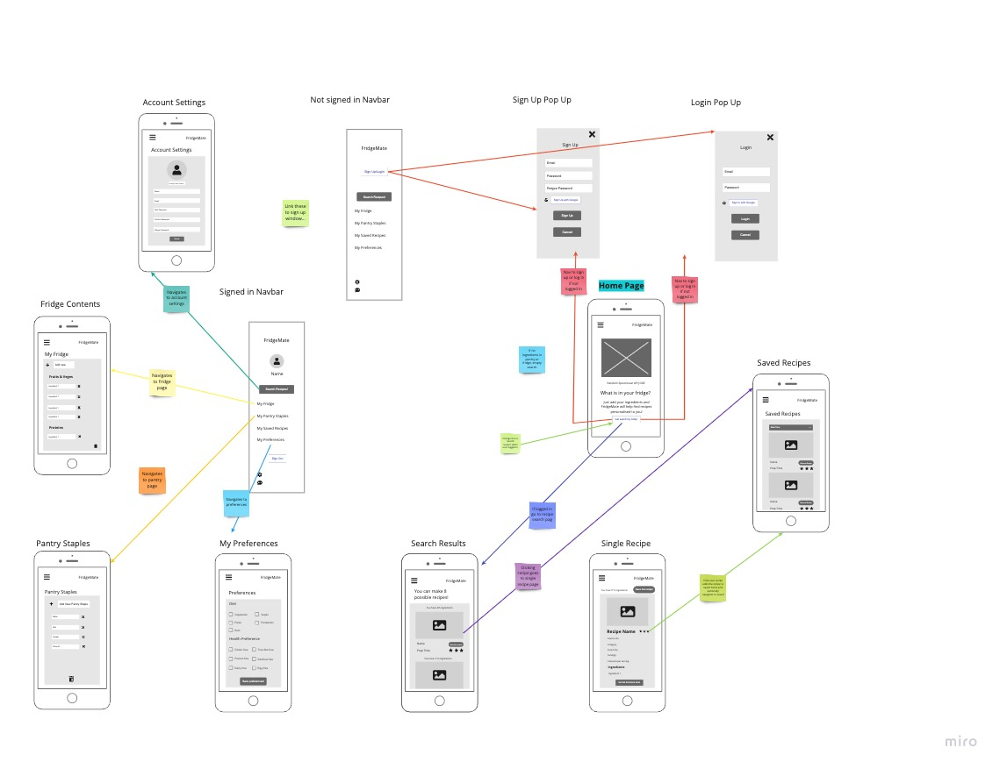    
#### Tablet
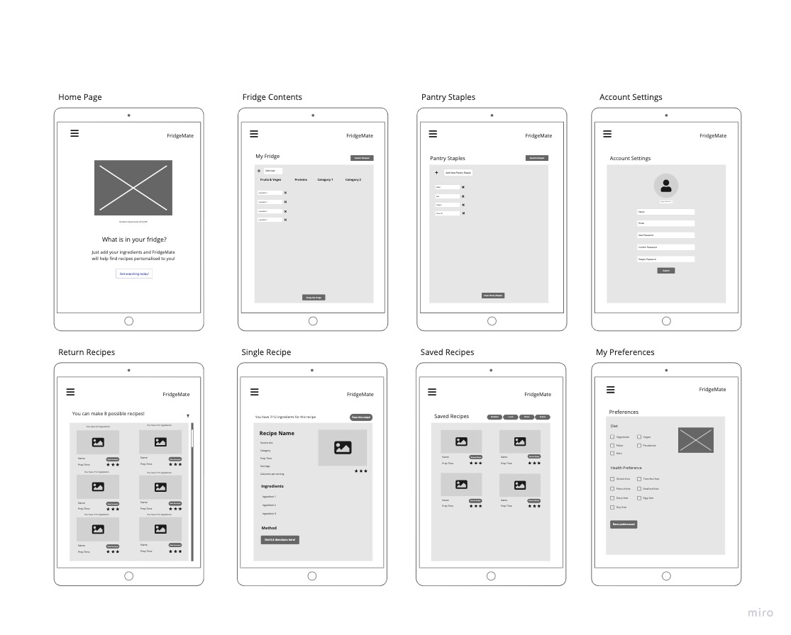
#### Desktop

#### Nav and Footer
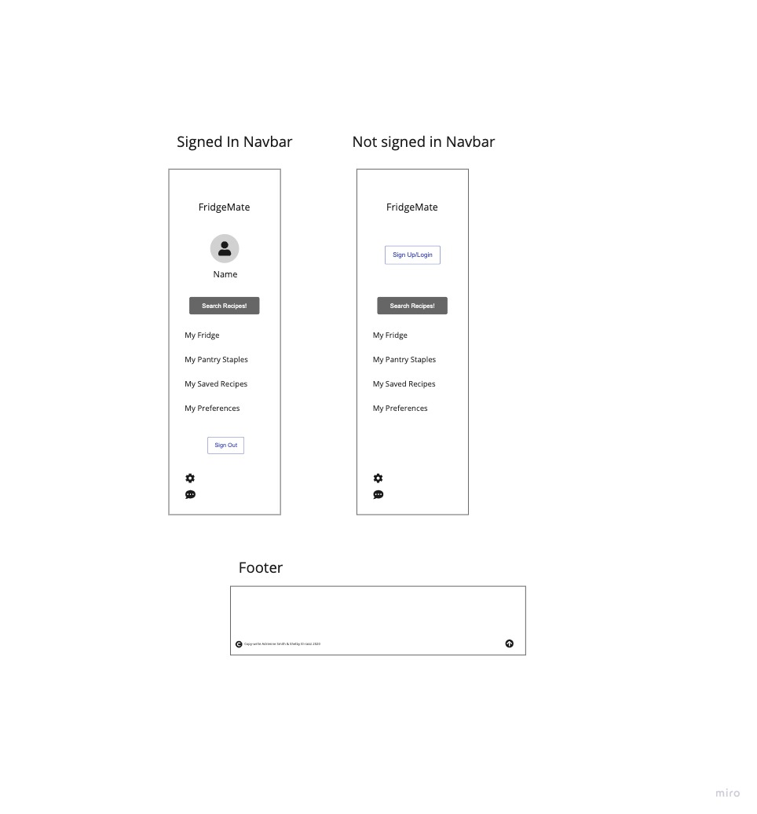
#### Pop Out Windows
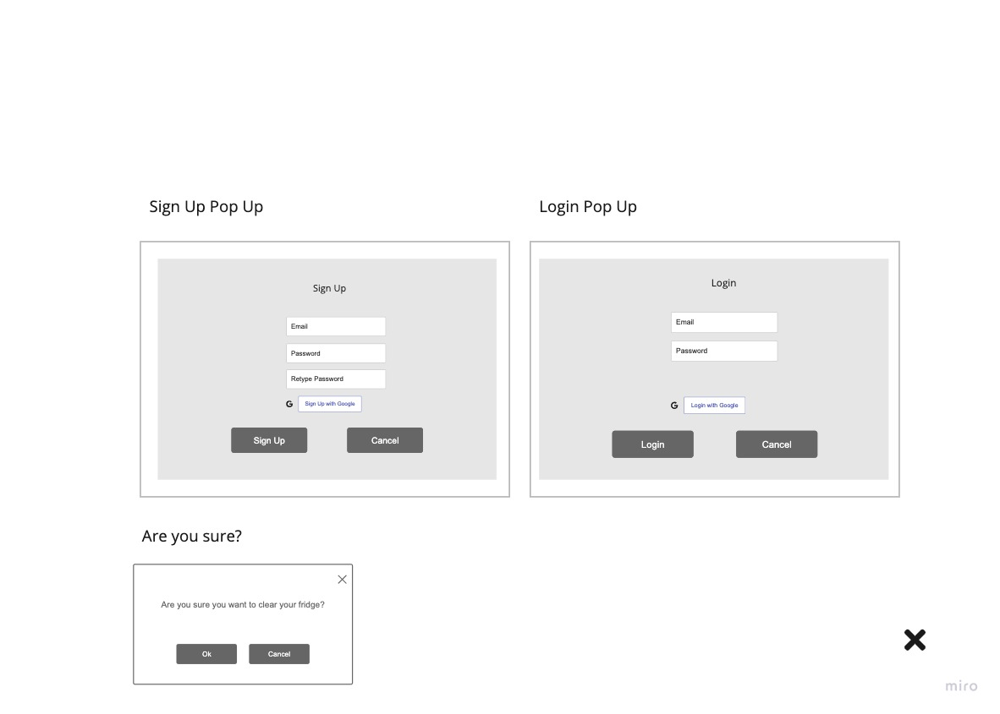

        

#### Prototypes

Click to expand

[Click here to View on Framer](https://framer.com/projects/Mockups-Prototypes--gQTgOBRzoQePnxdnXfiq-51eZf)

#### Pages

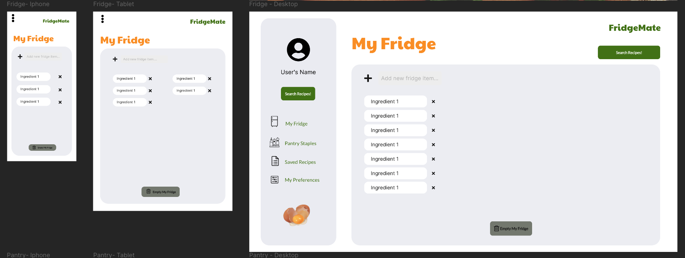
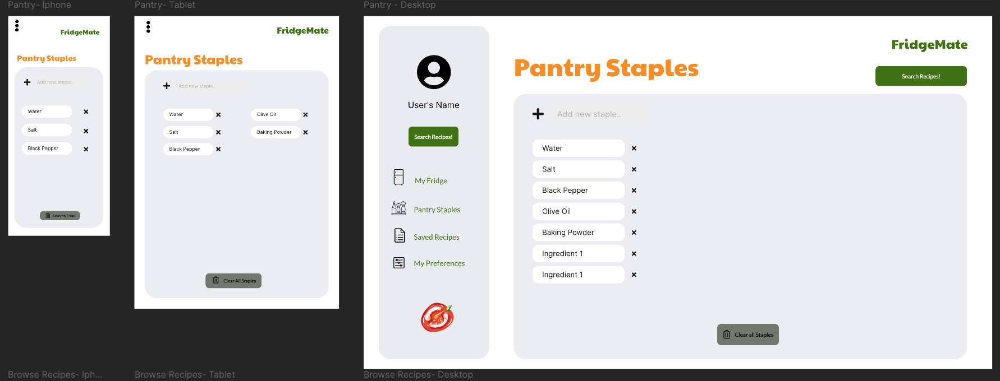    
  
   
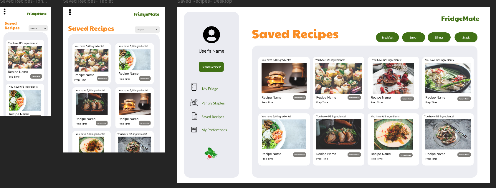  
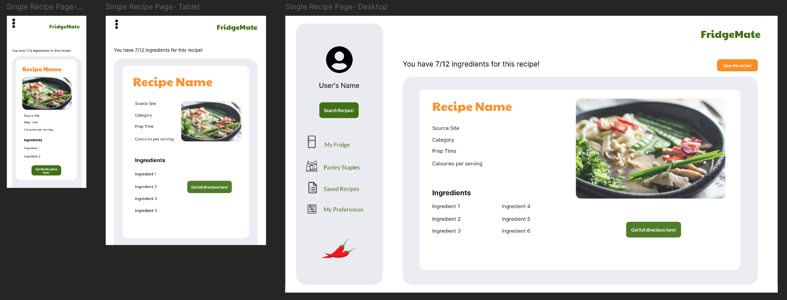  
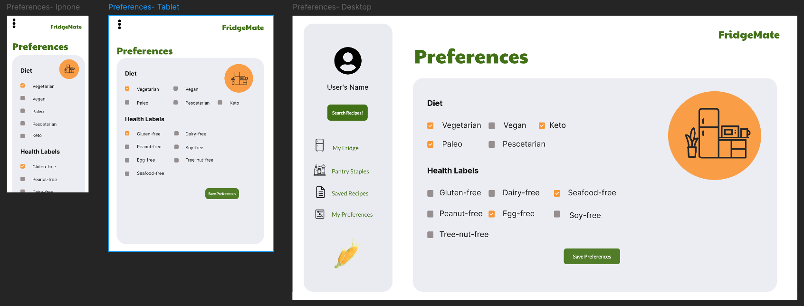  
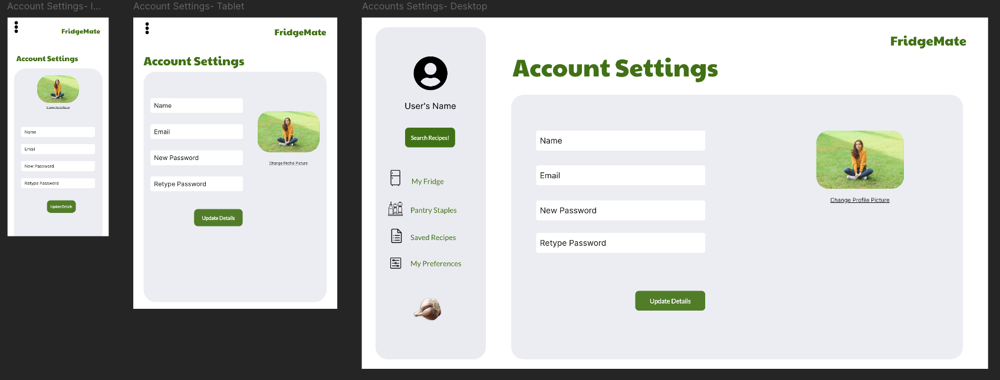  
  
  

#### How They Link
  

---
### Project Management- Trello

#### Documentation Planning

Click to expand

#### Application Planning

Click to expand

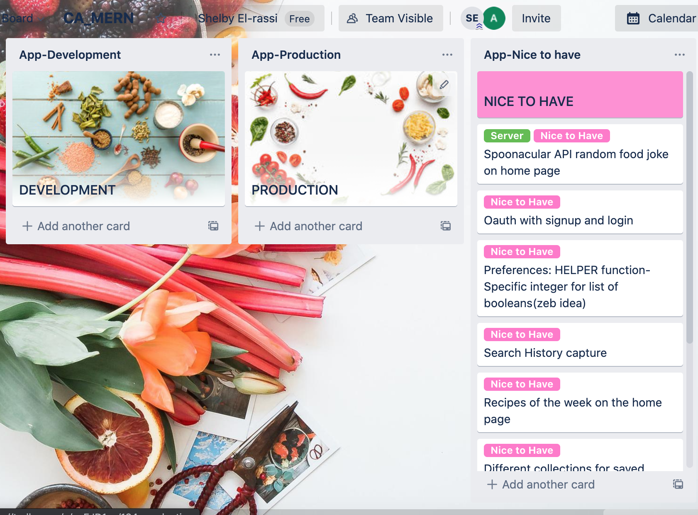

